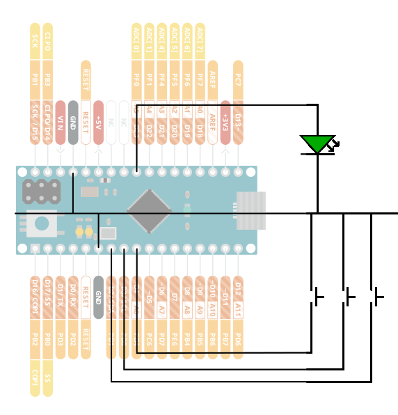

### Password Manager in a Box

This is the firmware for an Arduino Micro that emulates a USB keyboard, and has three buttons wired to it - pressing a button will type out one of three hard-coded phrases.

### Why?

I initially built this when I worked somewhere that banned password managers.  It was... a tradeoff.

It turns out to be fairly useful for e.g. typing out long email addresses.

### Setup

It's enough to `apt install arduino` to get to the IDE.

 - Be sure to choose the Arduino Micro from the board configuration
 - Programming happens in the first few seconds after boot

A quirk of this board is that the socket I used is too short, so the last two pins (furthest from the USB port) hang off the end.  If you remove the board from
the socket, remember which end has the overhang!  Conveniently (intentionally even), if you get it wrong, the LED on the side won't light up.

I found I had to manually go find the bootloader hex file, as it wasn't being generated by the build.  This seemed to remove the complaining:
```bash
cd ${WHEREVER}
git clone git@github.com:adafruit/Caterina-Bootloader.git
sudo ln -s \
    ${WHEREVER}/Caterina-Bootloader/Built\ Firmwares/Caterina-Micro.hex \
    /usr/share/arduino/hardware/arduino/avr/bootloaders/caterina/Caterina-Micro.hex
```

### Circuit


